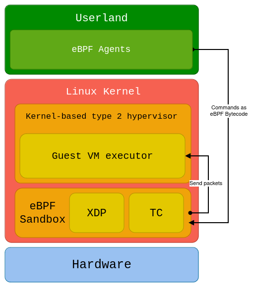

<h1 align="center">BlackPill</h1>
<p align="center">BlackPill is a stealthy Linux rootkit made in Rust.<p>
<div align="center">
    
    
    
</div>

## Features



- Hides itself from the modules list

## Development environment

### Description

Multiple steps needs to be done before compiling our rootkit. The development environment is composed of :
- a simple Alpine Linux image providing essential tools
- a custom compiled kernel with Rust activated
- a simple QEMU virtual machine accelerated by KVM

Start by cloning the repository and its shallow submodules :
```shell
$ git clone git@github.com:DualHorizon/blackpill.git --recursive --depth 1
```

### Important dependencies

On an arch-based distribution :

```shell
$ sudo pacman -S qemu-base qemu-desktop docker grub
```

### Linux kernel

On an arch-based Linux distribution, install Rust and other dependencies :

```shell
$ sudo pacman -S rust rust-src rust-bindgen
$ sudo pacman -S clang lld llvm
```

Then we'll need Rust sources and bindgen :

```shell
$ rustup component add rust-src clippy rustfmt
$ cargo install --locked bindgen-cli
```

Make sure you can start compiling your kernel with Rust by running in folder `linux/` :

```shell
$ cd blackpill
$ pushd linux
$ make LLVM=1 rustavailable
Rust is available!
$ popd
```

Launch the first time setup task which configures and compiles the kernel :

```shell
$ make first-time-setup
```

> [!IMPORTANT]
> If you are asked of customizing options, press Enter each time.

### Rootkit

You can compile the Rust kernel module (out-of-tree) with :

```shell
$ make
```

Launch the VM with :

```shell
$ make vm
```

Inside the VM, login with `root:root` (note: to be changed to automatic login) and enable the module :

```shell
$ modprobe blackpill
# you can check kernel logs with
$ dmesg
```

## Usage

todo

## Credits

Environment setup :
- [Setting Up an Environment for Writing Linux Kernel Modules in Rust - The Linux Foundation](https://www.youtube.com/watch?v=tPs1uRqOnlk)
- [Kernel config qemu-busybox-min.config patch](https://lore.kernel.org/rust-for-linux/20230609063118.24852-18-amiculas@cisco.com/)
- [Rust out-of-tree module](https://github.com/Rust-for-Linux/rust-out-of-tree-module)
